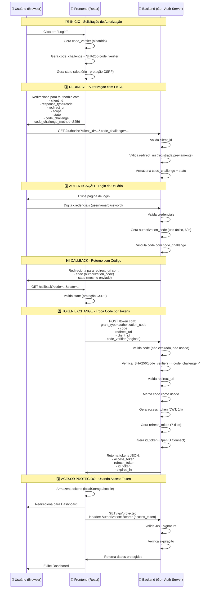

<div align="center">

# 🔐 OAuth 2.0 + PKCE Learning Project

### Implementação completa de um servidor OAuth 2.0 com autenticação segura

[](https://golang.org/)
[](https://react.dev/)
[](https://www.docker.com/)
[](LICENSE)

</div>

---

## Sobre o Projeto

Este projeto é uma **implementação educacional completa** de um sistema OAuth 2.0 com PKCE (Proof Key for Code Exchange), desenvolvido para demonstrar as melhores práticas de autenticação e autorização moderna.

### 🎯 Objetivos de Aprendizado

- ✅ Entender o fluxo completo do **OAuth 2.0 Authorization Code Flow**
- ✅ Implementar **PKCE** para segurança adicional em aplicações públicas
- ✅ Construir um **Authorization Server** do zero
- ✅ Gerenciar **tokens JWT** (Access Token, Refresh Token, ID Token)
- ✅ Aplicar **boas práticas de segurança** em autenticação
- ✅ Desenvolver com **hot-reload** em containers Docker

---

## 🏗️ Arquitetura do Fluxo OAuth 2.0 + PKCE

### 📊 Diagrama do Fluxo Completo



### 🔐 Parâmetros da Solicitação de Autorização

Quando o usuário clica em "Login", a aplicação constrói uma URL no formato:

```
https://authorization-server.com/oauth/authorize?
  client_id=a17c21ed
  &response_type=code
  &state=5ca75bd30
  &redirect_uri=https%3A%2F%2Fexample-app.com%2Fauth
  &scope=photos
  &code_challenge=E9Melhoa2OwvFrEMTJguCHaoeK1t8URWbuGJSstw-cM
  &code_challenge_method=S256
```

#### 📋 Descrição dos Parâmetros

| Parâmetro | Obrigatório | Descrição |
|-----------|-------------|-----------|
| `response_type` | ✅ Sim | Sempre `code` - indica que queremos um authorization code |
| `client_id` | ✅ Sim | Identificador único da aplicação (recebido no registro) |
| `redirect_uri` | ⚠️ Depende | URL de callback (deve estar pré-registrada no servidor) |
| `scope` | ❌ Opcional | Níveis de acesso solicitados (ex: `photos`, `profile`, `email`) |
| `state` | ⭐ Recomendado | Valor aleatório para proteção CSRF e persistência de estado |
| `code_challenge` | 🔒 PKCE | Hash SHA256 do `code_verifier` |
| `code_challenge_method` | 🔒 PKCE | Sempre `S256` (método seguro) |

### 🛡️ PKCE - Proof Key for Code Exchange

**Problema resolvido:** "E se minha app não conseguir guardar o `client_secret` em segurança?"

**Solução:** PKCE adiciona uma camada de prova criptográfica que vincula quem pediu o código com quem vai trocá-lo por tokens.

#### 🔄 Como funciona:

```javascript
// 1️⃣ Frontend gera um código aleatório
const code_verifier = generateRandomString(128); // Ex: "dBjftJeZ4CVP-mB92K27uhbUJU1p1r_wW1gFWFOEjXk"

// 2️⃣ Frontend cria um hash SHA256 desse código
const code_challenge = base64URL(SHA256(code_verifier)); // Ex: "E9Melhoa2OwvFrEMTJguCHaoeK1t8URWbuGJSstw-cM"

// 3️⃣ Frontend envia o HASH na request /authorize
// Backend armazena: code_challenge + authorization_code

// 4️⃣ Frontend envia o código ORIGINAL na request /token
// Backend valida: SHA256(code_verifier) === code_challenge ✓
```

**Proteção:** Mesmo que alguém intercepte o `authorization_code`, não conseguirá trocá-lo por tokens sem o `code_verifier` original!

### 🔄 Troca do Authorization Code por Tokens

Após aprovação, o backend redireciona para:
```
https://example-app.com/callback?code=AUTH_CODE_HERE&state=5ca75bd30
```

O frontend então faz um POST para `/token`:

```http
POST /token HTTP/1.1
Host: authorization-server.com
Content-Type: application/x-www-form-urlencoded

grant_type=authorization_code
&code=AUTH_CODE_HERE
&redirect_uri=https://example-app.com/callback
&client_id=a17c21ed
&code_verifier=dBjftJeZ4CVP-mB92K27uhbUJU1p1r_wW1gFWFOEjXk
```

#### 📋 Parâmetros do Token Exchange

| Parâmetro | Obrigatório | Descrição |
|-----------|-------------|-----------|
| `grant_type` | ✅ Sim | Sempre `authorization_code` |
| `code` | ✅ Sim | Authorization code recebido no callback |
| `redirect_uri` | ⚠️ Se usado antes | Deve ser idêntico ao enviado em /authorize |
| `client_id` | ✅ Sim | Identificador da aplicação |
| `code_verifier` | 🔒 PKCE | Código original (não o hash!) |

#### 📤 Resposta com Tokens

```json
{
  "access_token": "eyJhbGciOiJIUzI1NiIsInR5cCI6IkpXVCJ9...",
  "token_type": "Bearer",
  "expires_in": 3600,
  "refresh_token": "tGzv3JOkF0XG5Qx2TlKWIA",
  "id_token": "eyJhbGciOiJSUzI1NiIsImtpZCI6IjFlOWdkazcifQ..."
}
```

### 🎯 Importância do `state`

O parâmetro `state` possui duas funções críticas:

1. **🔒 Proteção CSRF**: Valor aleatório que deve ser validado no callback
   ```javascript
   // Antes do redirect
   const state = generateRandomString();
   sessionStorage.setItem('oauth_state', state);
   
   // No callback
   const receivedState = urlParams.get('state');
   if (receivedState !== sessionStorage.getItem('oauth_state')) {
     throw new Error('CSRF Attack Detected!');
   }
   ```

2. **📌 Persistência de Estado**: Armazena para onde redirecionar após login
   ```javascript
   // Codifica a página de destino no state
   const state = btoa(JSON.stringify({
     random: generateRandomString(),
     returnTo: '/dashboard/settings'
   }));
   ```

### 📖 Documentação Detalhada

Para entender cada etapa do fluxo em profundidade:
📖 **[Authorization Flow Guide - Guia Completo](./back/authorization_flow_guide.md)**

---

## Quick Start

### Pré-requisitos

- Docker & Docker Compose
- (Opcional) Go 1.25+ e Node.js 22+ para desenvolvimento local

### 1️⃣ Clone e Configure

```bash
# Clone o repositório
git clone <seu-repo>
cd OAuth

# Configure as variáveis de ambiente
cp back/.env.example back/.env
cp front/.env.example front/.env
```

### 2️⃣ Execute com Docker

```bash
# Inicia todos os serviços com hot-reload
docker-compose up --build
```

### Acesse a Aplicação

- 🌐 **Frontend**: http://localhost:5173
- 🔧 **Backend API**: http://localhost:8080

---

## Documentação

### Guias Detalhados

| Tópico | Descrição | Link |
|--------|-----------|------|
| 🐳 **Docker** | Configuração completa do ambiente Docker | [.docker/README.md](./.docker/README.md) |
| 🔄 **Fluxo OAuth** | Entenda cada etapa do Authorization Code Flow | [back/authorization_flow_guide.md](./back/authorization_flow_guide.md) |
| 🔧 **Backend** | Arquitetura e implementação do servidor OAuth | [back/README.md](./back/README.md) *(criar)* |
| 🎨 **Frontend** | Estrutura da aplicação React | [front/README.md](./front/README.md) *(criar)* |

### 🛠️ Tecnologias Utilizadas

#### Backend (Go)
- **Echo Framework** - Web framework minimalista e performático
- **Air** - Hot-reload para desenvolvimento ágil
- **JWT** - Geração e validação de tokens
- **SQLite** - Banco de dados leve para persistência

#### Frontend (React)
- **Vite** - Build tool ultrarrápido com HMR
- **TanStack Router** - Roteamento type-safe
- **TanStack Query** - Gerenciamento de estado e cache
- **Tailwind CSS** - Framework CSS utilitário

#### DevOps
- **Docker** - Containerização dos serviços
- **Docker Compose** - Orquestração multi-container
- **Network Bridge** - Comunicação segura entre containers

---

## Comandos Principais


##### Iniciar ambiente de desenvolvimento
```bash
docker-compose up --build
```

##### Ver logs em tempo real
```bash
docker-compose logs -f
```
##### Reiniciar um serviço específico
```bash
docker-compose restart backend
docker-compose restart frontend
```

##### Parar todos os serviços
```bash
docker-compose down
```

##### Rebuild sem cache
```bash
docker-compose build --no-cache
```

📖 **Mais comandos**: Veja [.docker/README.md](./.docker/README.md)

---

## 🔐 Conceitos de Segurança Implementados

### PKCE (Proof Key for Code Exchange)
Protege contra ataques de interceptação de código de autorização em aplicações públicas (SPAs, Mobile Apps).

### JWT com Claims Personalizados
- **Access Token**: Curta duração (1h), usado para acessar recursos
- **Refresh Token**: Longa duração (7 dias), usado para renovar access tokens
- **ID Token**: Informações do usuário autenticado

### CORS Configurável
Proteção contra requisições de origens não autorizadas.

### Rate Limiting
Prevenção de ataques de força bruta e DDoS.

---

## 📂 Estrutura do Projeto

```
OAuth/
├── 📁 back/                      # Backend (Go)
│   ├── 📁 cmd/app/              # Entry point da aplicação
│   ├── 📁 internal/             # Lógica de negócio
│   │   ├── config/             # Configurações
│   │   ├── domain/             # Regras de negócio
│   │   ├── handler/            # HTTP handlers
│   │   └── services/           # Serviços OAuth
│   ├── 📁 .docker/             # Dockerfile de desenvolvimento
│   ├── .env.example            # Template de variáveis
│   └── authorization_flow_guide.md
│
├── 📁 front/                    # Frontend (React)
│   ├── 📁 src/
│   │   ├── components/        # Componentes React
│   │   ├── routes/            # Páginas e rotas
│   │   └── lib/               # Utilitários
│   ├── 📁 .docker/            # Dockerfile de desenvolvimento
│   └── .env.example           # Template de variáveis
│
├── 📁 .docker/                 # Documentação Docker
│   └── README.md
│
├── docker-compose.yml          # Orquestração
└── README.md                   # Este arquivo
```

---

## 🤝 Contribuindo

Este é um projeto educacional! Contribuições são bem-vindas:

1. Fork o projeto
2. Crie uma branch (`git checkout -b feature/nova-feature`)
3. Commit suas mudanças (`git commit -m 'Add: nova feature'`)
4. Push para a branch (`git push origin feature/nova-feature`)
5. Abra um Pull Request

---

## 📝 Licença

Este projeto está sob a licença MIT. Veja o arquivo [LICENSE](LICENSE) para mais detalhes.

---

## 🙏 Agradecimentos

Projeto desenvolvido para fins educacionais, inspirado nas especificações:
- [RFC 6749 - OAuth 2.0](https://datatracker.ietf.org/doc/html/rfc6749)
- [RFC 7636 - PKCE](https://datatracker.ietf.org/doc/html/rfc7636)
- [OpenID Connect Core](https://openid.net/specs/openid-connect-core-1_0.html)

---
